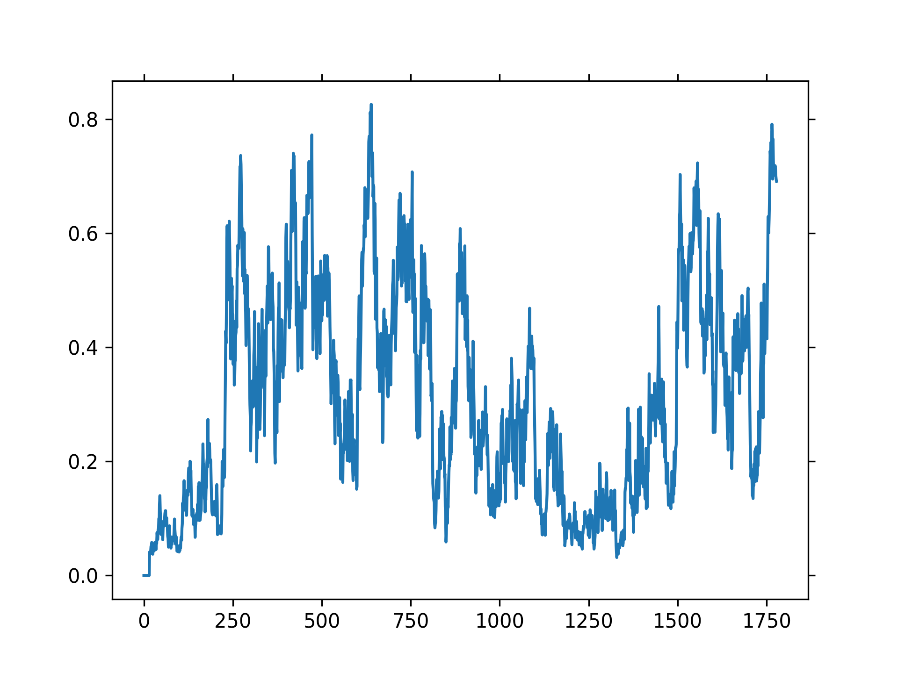
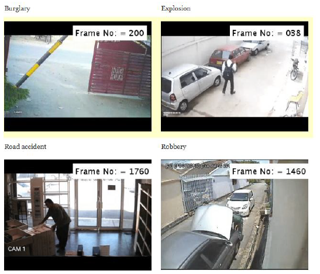

# Anomaly Detection in Surveillance Videos

## Project Overview

This project focuses on **anomaly detection in surveillance videos** using **deep learning**. The goal is to automatically identify **unusual activities** in videos, such as accidents, violence, theft, or other abnormal behaviors in real-world settings. The project **processes video frames, extracts features, and classifies whether a scene is normal or anomalous**.

### Applications
This anomaly detection system can be applied to various **real-world scenarios**, including:  

 **Public Safety**: Detecting crimes, accidents, or suspicious behavior in public areas.  
 **Smart Surveillance**: Automating CCTV monitoring to reduce manual supervision.  
 **Industrial Safety**: Monitoring factory environments for hazardous incidents.  
 **Healthcare & Elderly Care**: Identifying falls or medical emergencies.  
 **Traffic Surveillance**: Detecting traffic violations or accidents in real-time.  

## Models & Features

### 1. Models Used  
This project follows a **two-stage deep learning approach**:

1️. **Feature Extractor (Backbone Network)**   
   - **Model Used**: **I3D (Inflated 3D ConvNet)**  
   - **Pre-trained on**: **Kinetics-400** dataset  
   - **Purpose**: Extracts spatial-temporal features from **video frames**  
   - **Why I3D?** It captures **motion dynamics** effectively, making it ideal for video analysis.  

2️. **Classifier (Fully Connected Network)**   
   - **Custom-built neural network** (`Learner` class in `learner.py`)  
   - **Architecture**: Fully connected layers + ReLU + Dropout  
   - **Final Activation**: **Sigmoid (binary classification: anomaly vs. normal)**  

### 2. Extracted Features  
The model captures **spatial-temporal information** from video frames:  
🔹 **Spatial Features**: Identifying key objects, shapes, and patterns (e.g., people, vehicles).  
🔹 **Temporal Features**: Motion and activity patterns over time (e.g., abrupt movements, irregular behavior).  

Using **I3D**, the system learns **both appearance and motion cues** from surveillance videos to differentiate between normal and abnormal behavior.


## Datasets

Download the dataset from the following [link](https://drive.google.com/file/d/18nlV4YjPM93o-SdnPQrvauMN_v-oizmZ/view?usp=sharing) and unzip it under your `$DATA_ROOT_DIR`.

```shell
/workspace/DATA/UCF-Crime/all_rgbs
```

Defines the location where datasets should be stored.

### Directory Structure
```shell
DATA/
    UCF-Crime/
        ../all_rgbs
            ../~.npy
        ../all_flows
            ../~.npy
    train_anomaly.txt
    train_normal.txt
    test_anomaly.txt
    test_normal.txt
```
This provides a structured directory tree for dataset organization.

---

### 3. **Training and Testing Instructions**
## Training and Testing

Run the following script to train and test the model:

```bash
python main.py
```
This section tells users how to run the training/testing script.

---

### 4. **Model Components Explanation**
### Model Components
The implementation includes the following key components:
- **Feature Extractor**: Extracts deep features from video frames.
- **Classifier**: Learns to distinguish normal and anomalous events.
- **Loss Function (MIL Loss)**: Optimized for anomaly detection using Multiple Instance Learning.
- **Dataset Loader**: Handles loading and preprocessing of normal and anomalous video frames.

## Results

| METHOD | DATASET | AUC |
|:--------:|:--------:|:--------:|
| Original paper (C3D two stream) | UCF-Crimes | 75.41 |
| [RTFM](https://arxiv.org/pdf/2101.10030.pdf) (I3D RGB) | UCF-Crimes | 84.03 |
| Ours Re-implementation (I3D two stream) | UCF-Crimes | 84.45 |

## Visualization

Below is a sample visualization of the anomaly detection predictions:

<table>
  <tr>
    <td></td>
    <td></td>
  </tr>
</table>

Displays an image from the results.

---

### 5. **Dependencies Installation**

## Dependencies

Make sure you have the following dependencies installed:

```bash
pip install torch torchvision numpy opencv-python matplotlib tqdm
```
Lists the necessary Python libraries for running the project.

---

